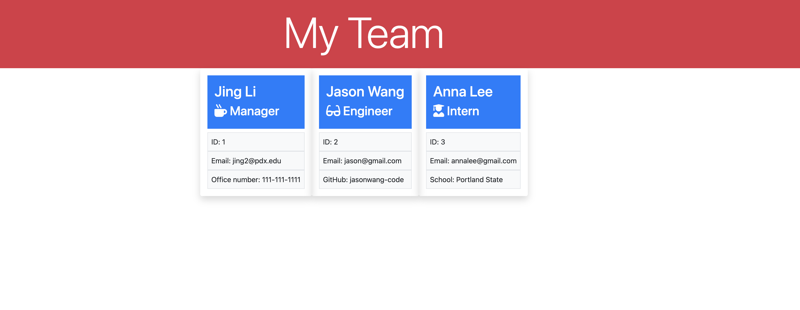

# Object-Oriented-Programming-Team-Profile-Generator

  ---
  ## Description
  This is a project about build a Node.js command-line application that takes in information about employees on a software engineering team, then generates an HTML webpage that displays summaries for each person. Also, there's a unit testing folder for every part of the code and ensure that it passes each tests to make code maintainable. 
  ---
  ## Table of Contents 
  - Link of the repo: https://github.com/lijing-code/Object-Oriented-Programming-Team-Profile-Generator
  - [Installation](#installation)
  - [Usage](#usage)
  - [Credits](#credits)
  - [License](#license)
  - [Tests](#tests)
  - [Questions](#questions)
  ---
  ## Installation
  * Login your Github
  * Find the right project
  * Run Node.js
  * Install npm
  * Answer the questions in the terminal
  * Generate a index.html in dist folder 

  ## Usage
  

  Walkthrough Video Link: https://drive.google.com/drive/folders/1Tm8mOaleE2Lu3ov3Ik-a3gcFgIR7A5sH
  
  ---
  ## Credits
  * Bootstrap for html:https://getbootstrap.com/
  ---
  ## License
  This project is using MIT license:
  

  ## How to Contribute
  
  * 

  ## Tests
  * make sure you have node.js and jest in your local computer
  * download the project folder
  * run node.js, install npm
  * run npm test in the project folder
  * you can get the test result in the terminal 

  ## Questions
  - My GitHub is https://github.com/lijing-code, please feel free to ask me if you have any question about my project.
  - My email is lijing900913@gmail.com.

